# PACBAS — Proximity-Based Continuous Attendance System

> BLE-powered classroom attendance: a stateless ESP32 beacon, an Android client that measures proximity, and a cloud backend that decides whether a check-in is valid.


---

## Table of Contents

1. [Overview](#1-overview)
2. [Key Features](#2-key-features)
3. [System Architecture](#3-system-architecture)
4. [Data Flow](#4-data-flow)
5. [Components](#5-components)
6. [Proximity Estimation](#6-proximity-estimation)
7. [Database Design](#7-database-design)
8. [REST API Reference](#8-rest-api-reference)
9. [Teacher Dashboard](#9-teacher-dashboard)
10. [Getting Started](#10-getting-started)
11. [Deployment](#11-deployment)
12. [Calibration](#12-calibration)
13. [Security Model](#13-security-model)
14. [Roadmap](#14-roadmap)
15. [Project Structure](#15-project-structure)
16. [Tech Stack](#16-tech-stack)
17. [Deployment Checklist](#17-deployment-checklist)
18. [Project Evolution](#18-project-evolution)

---

## 1. Overview

PACBAS automates classroom attendance using **Bluetooth Low Energy (BLE) proximity detection**. Students check in from an Android app only when they are physically near the classroom beacon; teachers control attendance sessions from a web dashboard.

The system follows a **"Dumb Beacon, Intelligent Backend"** philosophy:

| Layer | Responsibility |
|---|---|
| **ESP32** | Broadcasts a BLE beacon. Nothing else. |
| **Android app** | Detects the beacon, measures and filters RSSI, estimates proximity, submits check-in. |
| **Render backend** | Controls sessions, validates check-ins, enforces business rules. |
| **Supabase** | Persistently stores beacons, students, sessions and attendance. |

The ESP32 has **no Wi-Fi configuration, no cloud credentials, no HTTP client, no database connection and no student data**. This keeps the beacon cheap, simple, and easy to deploy.

---

## 2. Key Features

- **iBeacon-compatible ESP32 beacon** with fast-discovery and low-power steady-state advertising
- **RSSI smoothing** via sliding window and trimmed mean
- **Log-distance path-loss** proximity estimation
- **Teacher-controlled sessions** (start / end) — students never submit a session ID
- **Server-side validation** — student, beacon, session, duplicate and range checks
- **Duplicate prevention** enforced at the database level
- **Live teacher dashboard** with real-time check-ins, statistics and history
- **Per-classroom calibration** stored in the database
- **Cloud-native** — no local server, no shared Wi-Fi, no changing LAN IPs

---

## 3. System Architecture

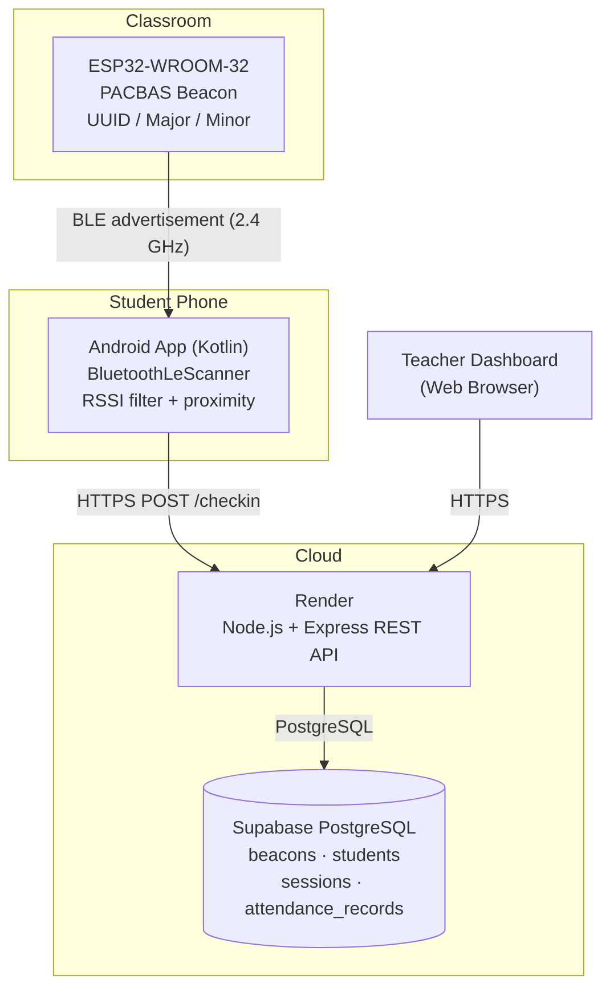

### Core principle

```text
ESP32  ──BLE──►  Android  ──HTTPS──►  Render  ──PostgreSQL──►  Supabase
                                        ▲
                                        └──HTTPS──  Teacher Dashboard
```

The ESP32 **never** communicates with Render or Supabase, and the Android app **never** accesses Supabase directly. The Express server is the only application layer between clients and the database.

---

## 4. Data Flow

### 4.1 End-to-end attendance sequence

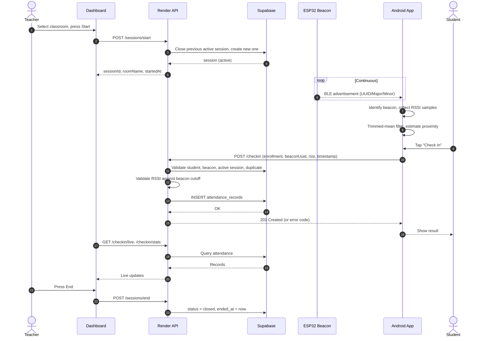

### 4.2 Check-in validation pipeline

The backend runs these checks in order and stops at the first failure.

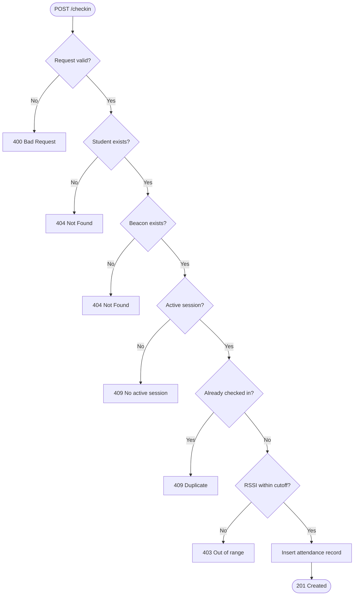

### 4.3 Session lifecycle

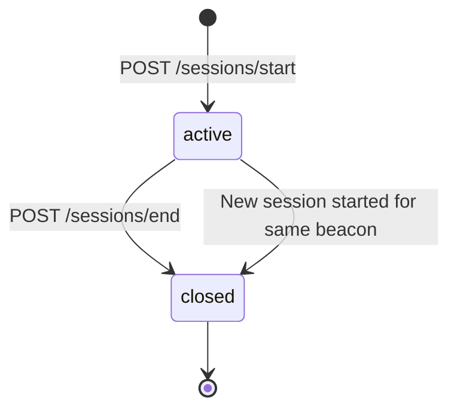

While a session is `active`, check-ins are accepted. Once `closed`, any `/checkin` returns `409 Conflict`.

### 4.4 RSSI processing pipeline (on-device)

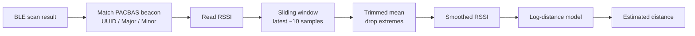

---

## 5. Components

### 5.1 Classroom beacon (ESP32)

| Item | Value |
|---|---|
| Hardware | ESP32-WROOM-32, ESP32 DevKit V1 |
| Radio | Bluetooth Low Energy 4.2, 2.4 GHz |
| Framework | Arduino ESP32 Core |
| Mode | Non-connectable BLE advertiser |
| Protocol | iBeacon-compatible (Apple manufacturer ID `0x004C`) |

Firmware: `esp32-beacon/PACBAS_Beacon/PACBAS_Beacon.ino`

```cpp
#define ROOM_UUID       "8ec76ea3-6668-48da-9866-75be8bc86f4d"
#define ROOM_MAJOR      101
#define ROOM_MINOR      1
#define MEASURED_POWER  -59
#define DEVICE_NAME     "PACBAS-Beacon-101-1"
```

**Advertising strategy**

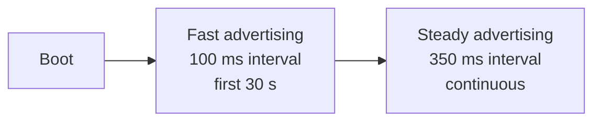

Fast discovery lets phones entering the room find the beacon quickly; the slower steady state reduces unnecessary airtime.

### 5.2 Android student app

Responsibilities: BLE scanning, beacon identification, RSSI collection and filtering, distance estimation, student identification, sending the check-in request, displaying the backend result.

Stack: Kotlin, Android SDK, `BluetoothLeScanner`, OkHttp, ViewBinding, RecyclerView, runtime permissions.

| File | Role |
|---|---|
| `ble/BleScanner.kt` | Manages the BLE scanner and feeds RSSI samples |
| `model/Beacon.kt` | Beacon model with sliding RSSI window |
| `network/ApiClient.kt` | HTTPS client for the backend |
| `ui/MainActivity.kt` | Main screen and check-in flow |
| `ui/BeaconAdapter.kt` | RecyclerView adapter for detected beacons |

The app does **not** open a BLE connection to the ESP32; it only listens to advertisements.

### 5.3 Render backend

Node.js + Express REST API deployed on Render with a public HTTPS endpoint, environment-variable configuration, auto-deploy from Git and health-check support. It also serves the teacher dashboard.

### 5.4 Supabase

Managed PostgreSQL providing persistent relational storage with foreign keys and unique constraints. It replaced the original SQLite database.

---

## 6. Proximity Estimation

PACBAS uses the **log-distance path-loss model**:

```text
d = 10 ^ ( (A − RSSI) / (10 · n) )
```

| Symbol | Meaning |
|---|---|
| `d` | Estimated distance (m) |
| `A` | Calibrated RSSI at 1 m (dBm) |
| `RSSI` | Measured (smoothed) signal strength (dBm) |
| `n` | Path-loss exponent |

**Worked example** with `A = -68.5 dBm`, `n = 2.7`:

| RSSI | Estimated distance |
|---|---|
| -60 dBm | ≈ 0.48 m |
| -75 dBm (cutoff) | ≈ 1.74 m |

> Distance is a **proximity indicator**, not a precise physical measurement. Raw RSSI is noisy (bodies, walls, desks, multipath, phone orientation, interference), which is why smoothing is applied.

---

## 7. Database Design

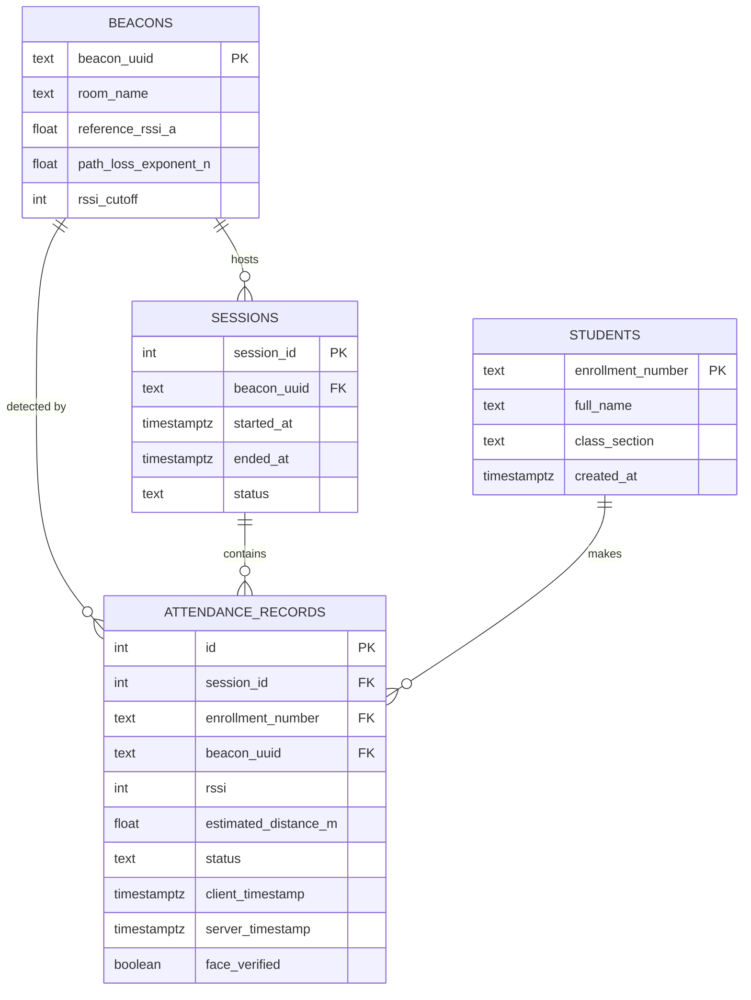

- `sessions.status`: `active` | `closed`
- `attendance_records.status`: `present` | `rejected_out_of_range`
- **Constraint:** `UNIQUE(session_id, enrollment_number)` — one record per student per session.

Example beacon row:

| Field | Value |
|---|---|
| `beacon_uuid` | `8ec76ea3-6668-48da-9866-75be8bc86f4d` |
| `room_name` | Room 101-1 |
| `reference_rssi_a` | -68.5 dBm |
| `path_loss_exponent_n` | 2.7 |
| `rssi_cutoff` | -75 dBm |

---

## 8. REST API Reference

### 8.1 Check-in

| Method | Endpoint | Description |
|---|---|---|
| `POST` | `/checkin` | Submit a student check-in |
| `GET` | `/checkin/live?minutes=30` | Recent check-ins within a time window |
| `GET` | `/checkin/stats` | Summary: totals, present, rejected, active session, room |
| `GET` | `/checkin/history` | Attendance history (filter by `enrollmentNumber` or `studentId`) |
| `GET` | `/checkin/beacons` | List registered beacons |
| `POST` | `/checkin/beacons` | Register a beacon with calibration values |

**Request — `POST /checkin`**

```json
{
  "enrollmentNumber": "IT2023001",
  "studentId": "STU-001",
  "beaconUuid": "8ec76ea3-6668-48da-9866-75be8bc86f4d",
  "rssi": -60,
  "clientTimestamp": "2026-10-04T10:30:00Z",
  "deviceId": "device-identifier"
}
```

**Response codes**

| Code | Meaning |
|---|---|
| `201` | Attendance recorded |
| `400` | Invalid request |
| `403` | Student outside configured proximity boundary |
| `404` | Student or beacon not found |
| `409` | No active session / duplicate / device conflict |
| `500` | Server or database error |

### 8.2 Sessions

| Method | Endpoint | Description |
|---|---|---|
| `POST` | `/sessions/start` | Start a session for a classroom (closes any previous active one) |
| `POST` | `/sessions/end` | End the active session |

```json
{
  "sessionId": 12,
  "roomName": "Room 101-1",
  "status": "active",
  "startedAt": "2026-10-04T10:00:00Z"
}
```

### 8.3 Students

| Method | Endpoint | Description |
|---|---|---|
| `GET` | `/students` | List students |
| `GET` | `/students/:enrollmentNumber` | Get one student |
| `POST` | `/students` | Register a student |

```json
{
  "enrollmentNumber": "IT2023001",
  "fullName": "Demo Student One",
  "classSection": "IT-3A"
}
```

### 8.4 Health

| Method | Endpoint | Description |
|---|---|---|
| `GET` | `/health` | Service and database availability |
| `GET` | `/api/health` | Alias of the above |

---

## 9. Teacher Dashboard

Served by the backend at the Render URL. Provides:

- Classroom selection
- Start / end attendance
- Active session status
- Present and rejected counts
- Recent check-ins (live)
- Attendance history
- Beacon status

> **Cold-start tip:** On Render's free tier, a sleeping service needs time to wake. Open the dashboard about **1 minute before class** so the service is ready before students check in.

---

## 10. Getting Started

### Prerequisites

- Node.js 18+
- A Supabase project
- Android Studio (for the app)
- Arduino IDE with ESP32 board support (for the beacon)

### Run the backend locally

```bash
git clone <repository-url>
cd PACBAS
npm install
cp .env.example .env
```

Edit `.env`:

```env
SUPABASE_URL=your-supabase-url
SUPABASE_SERVICE_ROLE_KEY=your-service-role-key
PORT=3000
```

```bash
npm start
# http://localhost:3000
```

### Set up Supabase

1. Create a project.
2. Open **SQL Editor → New Query**.
3. Run the PACBAS schema (`beacons`, `students`, `sessions`, `attendance_records`).
4. Seed the initial beacon and any demo students.

### Flash the beacon

1. Open `esp32-beacon/PACBAS_Beacon/PACBAS_Beacon.ino`.
2. Set `ROOM_UUID`, `ROOM_MAJOR`, `ROOM_MINOR`, `MEASURED_POWER`.
3. Upload to the ESP32 DevKit V1.

### Configure the Android app

| Environment | Backend URL |
|---|---|
| Development | `http://192.168.x.x:3000` |
| Production | `https://<your-service>.onrender.com` |

Make the backend URL configurable instead of hardcoding a LAN address into the APK.

---

## 11. Deployment

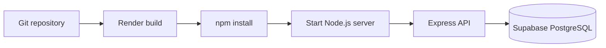

Set environment variables in **Render Dashboard → Service → Environment**. Never place production secrets in source code.

> ⚠️ The Supabase **service-role key must stay server-side**. Never embed it in the Android APK, frontend JavaScript, the Git repository, this README, or any public configuration.

---

## 12. Calibration

Each classroom should be calibrated individually.

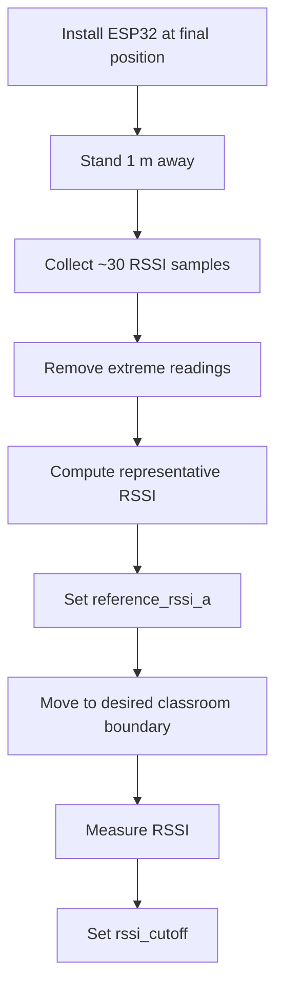

**Recommended placement:** center of the classroom ceiling, about 2.5 m above the floor. This avoids an oversized RF boundary caused by placing the beacon near a door.

Example values (environment-specific, not universal):

| Parameter | Value |
|---|---|
| Reference RSSI (A) | -68.5 dBm |
| Path-loss exponent (n) | 2.7 |
| RSSI cutoff | -75 dBm |

---

## 13. Security Model

PACBAS was explicitly audited for security weaknesses. Cloud migration improved availability, HTTPS transport, centralized control and persistence, but it **does not remove the underlying BLE/RSSI trust problem**.

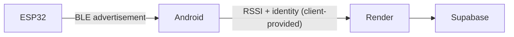

RSSI is **client-provided measurement data, not cryptographic proof of presence**.

### Known limitations

| Threat | Description |
|---|---|
| **RSSI spoofing** | A malicious client can submit a stronger RSSI than it measured; the backend cannot independently verify it. |
| **Static beacon cloning** | The iBeacon UUID/Major/Minor is static and can be re-broadcast by another BLE device. |
| **Identity spoofing** | A submitted enrollment number may belong to someone else. |
| **Replay** | Captured valid requests are reusable without nonces or short-lived tokens. |
| **RF boundary** | Signal can leak near doors, corridors, windows and thin walls. |
| **Free-tier limits** | Render cold starts and Supabase free-tier quotas apply. |
| **Open history** | Attendance history must be protected before production use. |

### Hardening plan

**Phase 1 — Access control**
- JWT authentication for students and teachers
- Role-based access control
- Strict request validation and rate limiting
- Protected attendance history and dashboard

**Phase 2 — Dynamic beacon authentication**

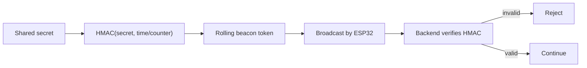

**Phase 3 — Device binding**

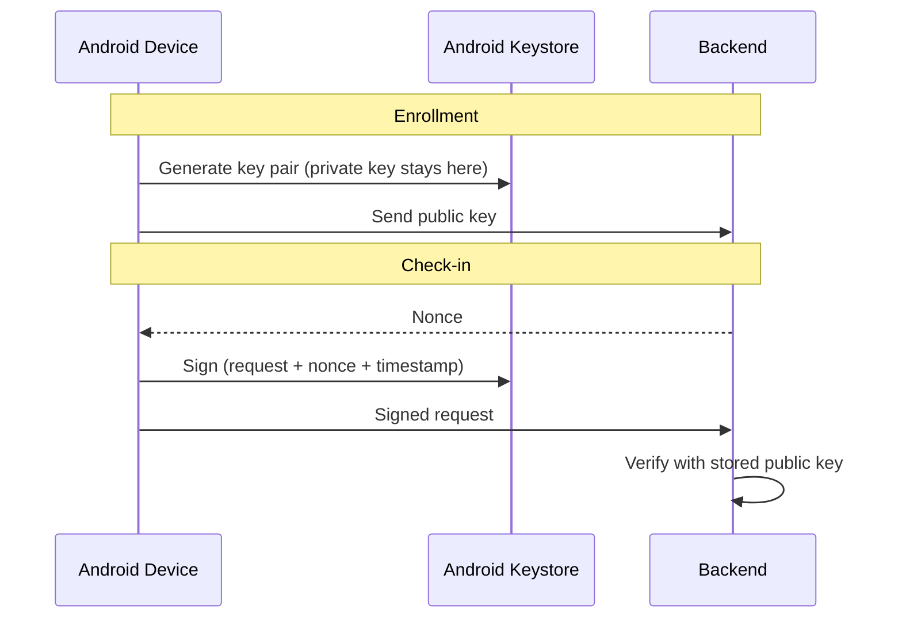

**Phase 4 — Biometrics:** Android `BiometricPrompt` before signing the check-in, as an additional identity factor (not a replacement for backend authentication).

---

## 14. Roadmap

**Completed**

- [x] ESP32 iBeacon-compatible BLE beacon
- [x] Android BLE scanning, RSSI collection, smoothing, proximity estimation
- [x] Android check-in flow
- [x] Node.js/Express backend with session lifecycle
- [x] Student directory and teacher dashboard
- [x] SQLite prototype → Supabase PostgreSQL
- [x] Security audit
- [x] Render deployment with public HTTPS backend
- [x] Removal of local-LAN dependency

**Next milestones**

- [ ] Authentication and authorization
- [ ] Dynamic beacon authentication (HMAC rolling tokens)
- [ ] Device binding (Android Keystore)
- [ ] Biometric verification
- [ ] Replay protection (nonces)
- [ ] Rate limiting
- [ ] Protected teacher dashboard and audit logs
- [ ] Multi-classroom deployment
- [ ] Attendance analytics

**Target architecture**

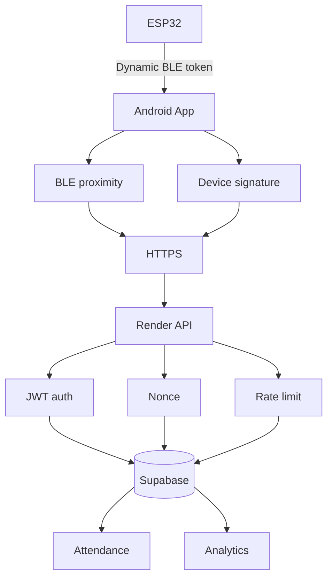

---

## 15. Project Structure

```text
PACBAS/
├── README.md
├── SETUP_GUIDE.md
├── .env.example
│
├── esp32-beacon/
│   └── PACBAS_Beacon/
│       └── PACBAS_Beacon.ino
│
├── android-app/
│   └── app/src/main/java/com/pacbas/attendance/
│       ├── ble/BleScanner.kt
│       ├── model/Beacon.kt
│       ├── network/ApiClient.kt
│       └── ui/
│           ├── MainActivity.kt
│           └── BeaconAdapter.kt
│
├── backend/
│   ├── server.js
│   ├── db.js
│   ├── routes/
│   │   ├── checkin.js
│   │   ├── sessions.js
│   │   └── students.js
│   ├── public/index.html
│   └── tests/
│
└── docs/
    ├── SECURITY_AUDIT_AND_ESP32_SETUP.md
    └── ARCHITECTURE_AND_SYSTEM_FLOW.md
```

> Exact layout may vary slightly as the implementation evolves.

---

## 16. Tech Stack

| Layer | Technology |
|---|---|
| Beacon hardware | ESP32-WROOM-32 |
| Firmware | C++ / Arduino ESP32 |
| Wireless | Bluetooth Low Energy |
| Beacon protocol | iBeacon-compatible advertisement |
| Mobile | Android (Kotlin) |
| BLE API | `BluetoothLeScanner` |
| Networking | OkHttp |
| Backend | Node.js, Express.js |
| Hosting | Render |
| Database | Supabase PostgreSQL |
| Dashboard | HTML / CSS / JavaScript |
| Transport | HTTPS |

---

## 17. Deployment Checklist

**ESP32**
- [ ] Correct UUID, Major/Minor and room mapping
- [ ] Calibrated reference RSSI and RSSI cutoff
- [ ] Mounted centrally, stable power supply

**Supabase**
- [ ] Database and tables created
- [ ] Foreign keys and unique constraints verified
- [ ] Demo data removed or replaced
- [ ] Service-role key protected

**Render**
- [ ] Repository connected, build and start commands configured
- [ ] Environment variables set
- [ ] Health endpoint and HTTPS URL working
- [ ] Cold start tested

**Android**
- [ ] Production backend URL configured
- [ ] BLE permissions configured
- [ ] Check-in tested, plus out-of-range, duplicate and no-active-session responses

**Teacher**
- [ ] Dashboard opens; Render warmed before class
- [ ] Correct classroom selected, session started
- [ ] Live attendance verified, session closed after class

---

## 18. Project Evolution

| Stage | Architecture | Goal |
|---|---|---|
| **1. Local prototype** | ESP32 → BLE → Android → HTTP → local Node.js → SQLite | Prove the BLE proximity concept |
| **2. Security audit** | Analysis of RSSI spoofing, beacon cloning, buddy punching, replay, unauthenticated APIs, cleartext HTTP, information disclosure, DoS, RF boundary | Show that proximity alone is not proof of presence |
| **3. Cloud migration** | ESP32 → BLE → Android → HTTPS → Render → Supabase | Remove local dependency, enable multi-classroom expansion |

Problems solved by the migration: changing local IPs, dependence on a server laptop, shared Wi-Fi requirement, limited accessibility and difficult deployment.

---

## Status

**Cloud-enabled working prototype.** PACBAS is not yet a fully hardened anti-cheat production system. Authentication, dynamic beacon authentication, replay protection and rate limiting are required before production use.

> **Dumb Beacon. Intelligent Mobile Client. Centralized Cloud Backend. Persistent Database.**
