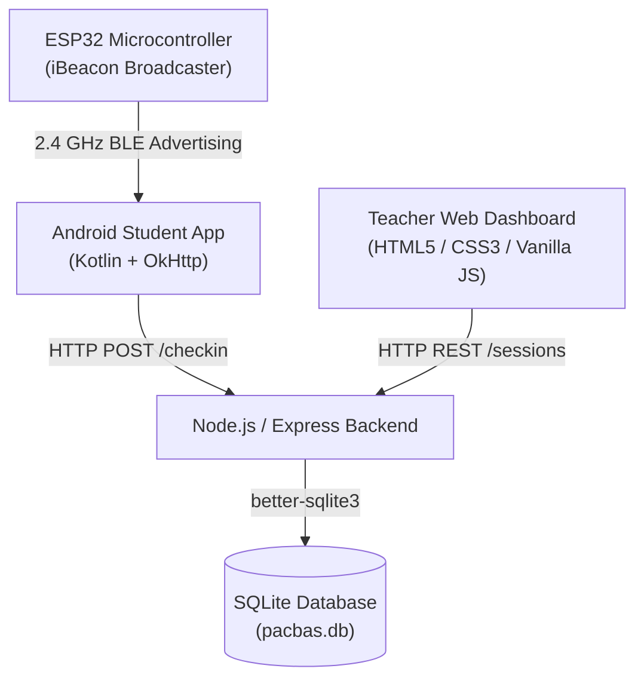

# PACBAS — System Architecture, Tech Stack, File Directory & End-to-End Flow

**PACBAS** (Proximity-Based Continuous Attendance System) is an IoT-enabled attendance platform designed around the **"dumb beacon, intelligent backend"** architectural philosophy.

---

## 1. Skills Demonstrated & Engineering Domains

| Domain / Skill | Where Applied | Key Concepts |
|---|---|---|
| **Embedded Systems & Firmware Development** | ESP32 WROOM-32 (`esp32-beacon/`) | C++, ESP32 BLE stack (`BLEDevice`, `BLEAdvertising`, `BLEBeacon`), iBeacon frame composition (Apple Manufacturer ID `0x004C`, Type `0x0215`), dual-phase advertising intervals for low latency and power efficiency. |
| **Mobile Development (Android / Kotlin)** | Android Native App (`android-app/`) | Kotlin, Android Bluetooth Low Energy APIs (`BluetoothLeScanner`, `ScanFilter`, `ScanSettings`), runtime permissions (Android 12+ `BLUETOOTH_SCAN`, `BLUETOOTH_CONNECT`, fine location), OkHttp networking, ViewBinding, RecyclerView UI architecture. |
| **RF Signal Modeling & Proximity Physics** | Mobile & Backend (`model/Beacon.kt`, `checkin.js`) | Log-Distance Path Loss Model ($d = 10^{\frac{A - \text{RSSI}}{10 \cdot n}}$), multipath fading mitigation, sliding window buffer, trimmed-mean filtering, wall boundary attenuation. |
| **Backend REST API Architecture** | Node.js Backend (`backend/`) | Node.js, Express.js, clean modular routing (`/checkin`, `/sessions`), request validation, defensive input sanitization, HTTP status semantic error design (201 Created, 403 Forbidden, 409 Conflict, 404 Not Found). |
| **Database Design & Relational Modeling** | SQLite Database (`backend/db.js`) | SQLite with `better-sqlite3`, schema migrations, foreign keys (`FK -> beacons`, `FK -> sessions`), compound uniqueness constraints (`UNIQUE(session_id, enrollment_number)`) for structural double-counting prevention. |
| **Full-Stack Web Interface & Real-time Telemetry** | Dashboard (`backend/public/index.html`) | Modern responsive UI, glassmorphism, CSS custom properties, asynchronous telemetry polling, interactive RF proximity simulator, live teacher session lifecycle controls. |

---

## 2. Complete Technology Stack

| Layer | Component | Technologies |
|---|---|---|
| **Hardware / IoT Beacon** | Classroom Gateway | ESP32 DevKit V1 (WROOM-32, Tensilica Xtensa 32-bit dual-core, 2.4 GHz BLE 4.2), Arduino Core for ESP32. |
| **Mobile Application** | Student Client | Android SDK 26–34+, Kotlin 1.9+, Android Jetpack (AppCompat, Material Components), OkHttp 4.12, Coroutines / Callbacks. |
| **Backend Service** | Application & API Server | Node.js (v18+ / v22), Express 4.19, CORS middleware. |
| **Persistence Layer** | Database | SQLite 3 via `better-sqlite3` (synchronous execution, zero external daemon overhead, ACID transactions). |
| **Frontend Dashboard** | Teacher Monitoring & Control | HTML5, Vanilla JavaScript (ES6+ async/await), Custom CSS Design System (Inter / Outfit / JetBrains Mono typography, CSS variables, dark theme glassmorphism). |
| **Testing & Tooling** | Quality Assurance | Node.js test runner (`backend/test_sessions.js`), Android Gradle build system. |

---

## 3. Comprehensive File-by-File Breakdown

### Root Directory
- **[`SETUP_GUIDE.md`](file:///var/home/krishnakumarpatel/Projects/Esp/SETUP_GUIDE.md)**: Operational setup guide for flashing the ESP32, discovering Wi-Fi LAN IP, starting Node.js server, building Android APK, teacher session controls, and troubleshooting.

### Embedded Firmware (`esp32-beacon/`)
- **[`PACBAS_Beacon/PACBAS_Beacon.ino`](file:///var/home/krishnakumarpatel/Projects/Esp/esp32-beacon/PACBAS_Beacon/PACBAS_Beacon.ino)**:
  - Configures the ESP32 as a fixed Apple iBeacon broadcaster with 128-bit UUID, Major (`101`), Minor (`1`), and calibrated Reference RSSI (`-59 dBm` at 1m).
  - Implements dual-phase advertising: fast discovery phase (100ms interval for first 30 seconds after boot) followed by normal phase (500ms interval) with non-blocking uptime heartbeat serial monitoring.

### Backend Application (`backend/`)
- **[`server.js`](file:///var/home/krishnakumarpatel/Projects/Esp/backend/server.js)**:
  - Application entry point. Configures Express middleware (CORS, JSON body parser), mounts static public files for the web dashboard, registers routers at `/checkin` and `/sessions`, and exposes a `/api/health` heartbeat.
- **[`db.js`](file:///var/home/krishnakumarpatel/Projects/Esp/backend/db.js)**:
  - Database connection and schema manager (`pacbas.db`).
  - Enforces foreign key constraints (`PRAGMA foreign_keys = ON`).
  - Defines schemas:
    - `beacons`: `beacon_uuid` (PK), `room_name`, calibrated parameters `reference_rssi_a`, `path_loss_exponent_n`, `rssi_cutoff`.
    - `sessions`: `session_id` (PK AUTOINCREMENT), `beacon_uuid` (FK), `started_at`, `ends_at`, `status` (`active` \| `closed`).
    - `attendance_records`: `id` (PK), `session_id` (FK), `enrollment_number`, `student_id`, `beacon_uuid`, `rssi`, `estimated_distance_m`, `status` (`present` \| `rejected_out_of_range`), `server_timestamp`, plus `UNIQUE(session_id, enrollment_number)`.
  - Performs non-destructive auto-migration for pre-existing tables and seeds default demo beacon `Room 101-1`.
- **[`routes/sessions.js`](file:///var/home/krishnakumarpatel/Projects/Esp/backend/routes/sessions.js)**:
  - `POST /sessions/start`: Atomically closes any existing open session for that room and opens a new active session.
  - `POST /sessions/end`: Closes the session and records `ends_at`.
  - `GET /sessions/active?beaconUuid=`: Fetches active session status and live attendee count.
  - `GET /sessions`: Returns recent session history.
- **[`routes/checkin.js`](file:///var/home/krishnakumarpatel/Projects/Esp/backend/routes/checkin.js)**:
  - `POST /checkin`: Executes the 6-step gate validation flow:
    1. Validates enrollment number / student ID.
    2. Validates beacon exists.
    3. Checks active session for beacon $\rightarrow$ rejects `409 Conflict` if no session is open.
    4. Evaluates RSSI threshold $\rightarrow$ rejects `403 Forbidden` if out of range.
    5. Verifies student hasn't already checked in $\rightarrow$ rejects `409 Conflict` if duplicate.
    6. Inserts attendance record tied to `session_id` and returns `201 Created` with class metadata and future-proof `faceVerified: null`.
  - `GET /checkin/history`: Attendance log filtered by student or room.
  - `GET /checkin/stats`: Summary metrics for dashboard KPI cards.
  - `GET /checkin/live`: Time-windowed check-ins.
  - `GET /checkin/beacons`: Provisioned rooms list.
- **[`public/index.html`](file:///var/home/krishnakumarpatel/Projects/Esp/backend/public/index.html)**:
  - Teacher controls: Start/End attendance sessions, live room selector, status badge.
  - KPI grid: Total check-ins, present count, rejected count, live session state, online beacons.
  - Real-time attendance feed with auto-polling every 5 seconds.
  - Interactive Proximity Simulator with signal strength slider and live status feedback.
- **[`test_sessions.js`](file:///var/home/krishnakumarpatel/Projects/Esp/backend/test_sessions.js)**:
  - Automated integration test suite validating all 11 lifecycle conditions (inactive session rejection, start session, valid check-in, duplicate blocking, out-of-range rejection, retry on in-range, end session, late check-in rejection, new session re-entry, stale session auto-cleanup).
- **[`scan_ble.js`](file:///var/home/krishnakumarpatel/Projects/Esp/backend/scan_ble.js)**:
  - Standalone Node diagnostic utility for BLE beacon testing.

### Android Application (`android-app/`)
- **[`app/src/main/java/com/pacbas/attendance/network/ApiClient.kt`](file:///var/home/krishnakumarpatel/Projects/Esp/android-app/app/src/main/java/com/pacbas/attendance/network/ApiClient.kt)**:
  - OkHttp REST client. Handles endpoint dispatch to `/checkin`.
  - Maps responses into typed Kotlin sealed class `CheckInResult`:
    - `Success(roomName, distanceMeters, rssi, sessionStartedAt)`
    - `SessionError(reason, isDuplicate)` (for HTTP 409 responses)
    - `Rejected(reason, distanceMeters, rssi)` (for HTTP 403 out of range)
    - `Error(message)` (network or HTTP error)
- **[`app/src/main/java/com/pacbas/attendance/ble/BleScanner.kt`](file:///var/home/krishnakumarpatel/Projects/Esp/android-app/app/src/main/java/com/pacbas/attendance/ble/BleScanner.kt)**:
  - Manages low-level Android BLE scanning via `BluetoothLeScanner` with low-latency scan mode.
  - Decodes 30-byte iBeacon manufacturer data frames and forwards parsed samples.
- **[`app/src/main/java/com/pacbas/attendance/model/Beacon.kt`](file:///var/home/krishnakumarpatel/Projects/Esp/android-app/app/src/main/java/com/pacbas/attendance/model/Beacon.kt)**:
  - Encapsulates beacon identity and mathematical smoothing. Maintains recent RSSI buffer (last 10 samples) and computes trimmed-mean RSSI (discarding highest and lowest outliers) to prevent transient fading spikes.
- **[`app/src/main/java/com/pacbas/attendance/ui/MainActivity.kt`](file:///var/home/krishnakumarpatel/Projects/Esp/android-app/app/src/main/java/com/pacbas/attendance/ui/MainActivity.kt)**:
  - Main user activity. Handles runtime BLE & location permission requests, Student ID / Enrollment input, server IP preferences dialog, and renders color-coded Snackbars for check-in results.
- **[`app/src/main/java/com/pacbas/attendance/ui/BeaconAdapter.kt`](file:///var/home/krishnakumarpatel/Projects/Esp/android-app/app/src/main/java/com/pacbas/attendance/ui/BeaconAdapter.kt)**:
  - Adapter that populates discovered beacon cards with dynamic 4-bar signal indicators, estimated distance in meters, in/out range badge, and the "Check In" button.

### Documentation (`docs/`)
- **[`docs/SECURITY_AUDIT_AND_ESP32_SETUP.md`](file:///var/home/krishnakumarpatel/Projects/Esp/docs/SECURITY_AUDIT_AND_ESP32_SETUP.md)**: Security vulnerability breakdown, relay attack analysis, and physical boundary evaluation.
- **[`docs/ARCHITECTURE_AND_SYSTEM_FLOW.md`](file:///var/home/krishnakumarpatel/Projects/Esp/docs/ARCHITECTURE_AND_SYSTEM_FLOW.md)**: This architecture and data flow document.

---

## 4. End-to-End Operational Lifecycle & Data Flow

```mermaid
sequenceDiagram
    autonumber
    actor Teacher
    participant Dashboard as Web Dashboard
    participant Backend as Node.js Backend
    participant DB as SQLite (pacbas.db)
    actor Student
    participant Phone as Android App
    participant ESP as ESP32 Beacon

    ESP->>Phone: 1. Constant BLE Advertising (UUID: 8ec76ea3..., TxPower: -59 dBm)
    Note over Phone: App measures RSSI (-60 dBm)<br/>Computes trimmed mean & ~1.1m

    Teacher->>Dashboard: 2. Clicks "Start Session" for Room 101-1
    Dashboard->>Backend: POST /sessions/start {beaconUuid}
    Backend->>DB: UPDATE sessions SET status='closed' WHERE beacon_uuid=? AND status='active'
    Backend->>DB: INSERT INTO sessions (beacon_uuid, started_at, status='active')
    Backend-->>Dashboard: 201 Created {sessionId: 1, roomName: "Room 101-1", startedAt}
    Note over Dashboard: Status changes to "● Session #1 Active"

    Student->>Phone: 3. Enters Student ID "STU-001" and taps "Check In"
    Phone->>Backend: POST /checkin {studentId, beaconUuid, rssi: -60}

    rect rgb(24, 32, 47)
    Note over Backend: 6-Step Gate Validation:
    Note over Backend: 1. Enrollment string present? (Yes)
    Note over Backend: 2. Beacon UUID known in DB? (Yes)
    Note over Backend: 3. Active session exists for this beacon? (Yes, #1)
    Note over Backend: 4. RSSI >= -75 dBm cutoff? (Yes, -60 >= -75)
    Note over Backend: 5. Already checked into session #1? (No)
    Note over Backend: 6. Insert record & return result
    end

    Backend->>DB: INSERT INTO attendance_records (session_id=1, enrollment_number="STU-001", rssi=-60, status="present")
    Backend-->>Phone: 201 Created {status: "present", sessionId: 1, roomName: "Room 101-1", sessionStartedAt: "...", faceVerified: null}
    Phone-->>Student: Displays: "✅ Present in Room 101-1 [Class: 16:30:00] (~1.1 m, -60 dBm)"

    opt Duplicate Attempt by Same Student
        Student->>Phone: Taps "Check In" again
        Phone->>Backend: POST /checkin {studentId: "STU-001", beaconUuid, rssi: -60}
        Backend-->>Phone: 409 Conflict {error: "Already checked in for this session"}
        Phone-->>Student: Displays: "ℹ️ Already checked in for this session"
    end

    opt Student Out of Range
        Student->>Phone: Attempts check-in with weak RSSI (-85 dBm)
        Phone->>Backend: POST /checkin {studentId: "STU-002", beaconUuid, rssi: -85}
        Backend-->>Phone: 403 Forbidden {error: "Outside RSSI boundary..."}
        Phone-->>Student: Displays: "❌ Rejected (Out of Range)"
    end

    Teacher->>Dashboard: 4. Clicks "End Session"
    Dashboard->>Backend: POST /sessions/end {sessionId: 1}
    Backend->>DB: UPDATE sessions SET status='closed', ends_at=datetime('now') WHERE session_id=1
    Backend-->>Dashboard: 200 OK {status: "closed", totalPresent: 1}

    opt Late Check-in After Session Closed
        Student->>Phone: Attempts check-in after class ends
        Phone->>Backend: POST /checkin {studentId: "STU-003", beaconUuid, rssi: -60}
        Backend-->>Phone: 409 Conflict {error: "No active session — has your teacher started attendance?"}
        Phone-->>Student: Displays: "⛔ No active session — has your teacher started attendance?"
    end
```

---

## 5. Summary of Architectural Advantages

1. **Beacon Stays Dumb & Unchanged**: The ESP32 is flashed once with a static UUID. It does not need Wi-Fi credentials, does not hold state, and cannot be spoofed or broken by network shifts.
2. **Tamper-Resistant Session Gating**: Students never transmit a session ID. The backend alone verifies whether an open session exists in that room.
3. **Database-Enforced Uniqueness**: `UNIQUE(session_id, enrollment_number)` prevents spamming and duplicate attendance at the database engine level.
4. **Clean Error Separation**: Students immediately understand *why* a check-in failed:
   - `409 No Active Session`: Teacher has not opened attendance yet.
   - `403 Outside RSSI Boundary`: Student is physically too far from the beacon.
   - `409 Already Checked In`: Student was already counted for this session.
